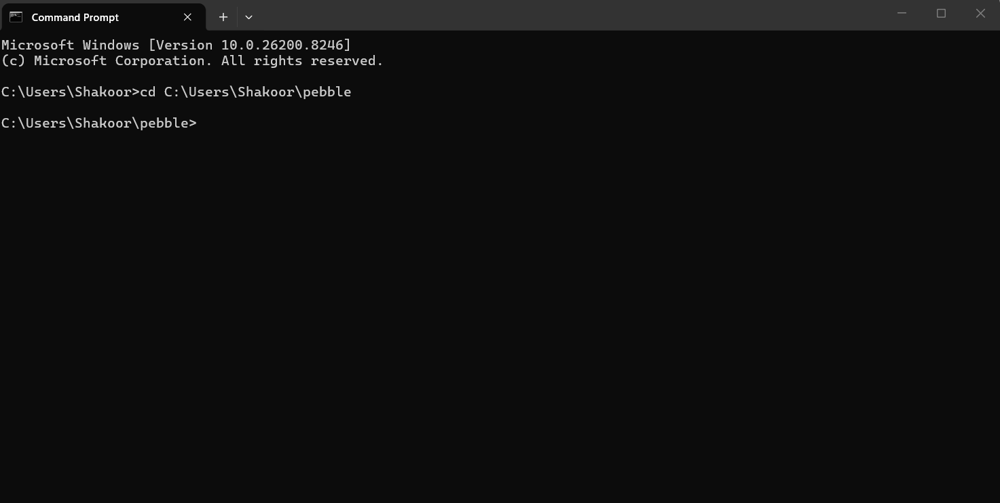

# pebble-ci

Deterministic failure memory and recovery engine for CI workflows.




**pebble-ci remembers which CI failures happened, which recoveries worked, and uses that history to choose the safest fix on the next run.**

It is a local-first failure memory engine for Rust projects with deterministic recovery and replayable operational history.

---

## Why pebble-ci Exists

Most CI tooling reruns the same failures forever without learning from them.

pebble-ci treats repeated operational failure as memory, not noise.

---

## The Problem

CI fails. You fix it. It fails the same way three weeks later. You fix it again. Nothing learns anything.

pebble-ci fixes that. It fingerprints failures, records which recovery commands succeeded, and on future runs uses that evidence to act — or escalates to you if it doesn't have enough to act safely.

---

## What It Does Today

- Runs your command (`cargo test`, `cargo fmt --check`, `cargo build`, etc.)
- Classifies the failure: format error, compile error, stale branch, network flake, test panic
- Runs an allowlisted recovery: `cargo fmt`, `cargo fix`, `cargo clean`, wait-and-retry, or guarded `git pull --rebase`
- Records the outcome in `.pebble/events.jsonl` inside your repo
- On future runs, consults that history before deciding what to do

**pebble-ci will only act from history when:**
- The failure fingerprint has at least **3 prior samples**
- The recovery has at least **70% prior success**

Otherwise it uses a deterministic default or escalates to you. It earns autonomy with evidence, not assumptions.

---

## Quick Start

### Install

```bash
cargo install pebble-ci
```

### Run

```bash
# Run against any Rust project
pebble-ci /path/to/your-project cargo fmt --check

# Preview what pebble-ci would do — no side effects, no writes
pebble-ci --dry-run /path/to/your-project cargo fmt --check

# View accumulated recovery history
pebble-ci stats /path/to/your-project
```

### From Source

```bash
git clone https://github.com/shakoorshkh/pebble
cd pebble
cargo install --path .
```

---


## GitHub Actions

```yaml
name: Pebble CI

on: [push, pull_request]

jobs:
  pebble:
    runs-on: ubuntu-latest

    steps:
      - uses: actions/checkout@v4

      - uses: shakoorshkh/pebble@v4.2.0
        with:
          repo-path: .
          command: cargo test
```

---


## Example Run

```
Attempt 1
Running: cargo fmt --check
Exit code:   1
Signal:      FormatFailure
Fingerprint: rust_format_check_failed

Recovery: running cargo fmt before retry.
Decision source: default-policy
Recovery result: OK - cargo fmt completed successfully

Attempt 2
Running: cargo fmt --check
Exit code:   0
Signal:      TaskCompleted

Verdict: real command completed successfully.
```

After three successful recoveries, pebble-ci uses trail memory:

```
Decision source: pebble-trail
Pebble trail selected CargoFmtAndRetry: 3/3 prior successes for this fingerprint
```

---

## Validation

pebble-ci ships with an end-to-end pressure suite covering:

- formatting recovery
- compile escalation
- dry-run safety
- trail learning
- branding consistency
- .gitignore idempotency
- deterministic retry behavior

Current status:

```
49/49 pressure tests passing
```

---

## Dry-Run Mode

Dry-run runs the command once so pebble-ci can classify real output. It does not run recovery commands, write memory, or write reports. It exits 1 if the observed command failed.

Use it to safely test new classifier rules or preview what pebble-ci would do in a new repo.

```bash
pebble-ci --dry-run . cargo fmt --check
```

---

## Classifiers

Failure detection lives in `src/classifiers.rs` behind a `SignalClassifier` trait.

| Classifier | What it detects |
|---|---|
| `CargoFmtCheckClassifier` | `cargo fmt --check` formatting failures |
| `GitStateClassifier` | Stale branch, merge conflict, rebase in progress |
| `InfraClassifier` | Network errors, HTTP 502/503/504, DNS failures |
| `RustToolchainClassifier` | Missing std/core/alloc — toolchain misconfiguration |
| `RustCompileClassifier` | rustc errors, type mismatches, borrow checker failures |
| `RustTestClassifier` | Test panics, assertion failures, retryable test timeouts |

Adding support for a new tool means adding one new struct that implements `SignalClassifier`. The executor core does not change.

---

## Recovery Actions

| Action | When used |
|---|---|
| `CargoFmtAndRetry` | Formatting failure; runs `cargo check` first to avoid wasting a retry on broken code |
| `CargoFixAndRetry` | Auto-fixable compile error (`unused import`, `machine-applicable` lint) |
| `CargoCleanAndRetry` | Alternating failure oscillation detected |
| `GitSyncAndRetry` | Stale branch; only runs when working tree is clean |
| `WaitAndRetry` | Network flake, transient infra failure |

---

## Safety Rules

- Commands run directly, never through a shell
- Unknown failures always escalate to human review
- Git rebase only runs on a clean working tree
- Same failure class capped at 3 retries before escalation
- Oscillation detection prevents infinite alternating failure loops
- Logs redacted for tokens, passwords, and API keys before storage
- `.pebble/` is added to `.gitignore` before any memory is written
- pebble-ci never claims success unless the command exits 0 after recovery

---

## Memory Format

pebble-ci stores recovery history in `.pebble/events.jsonl` inside each repo it runs against. Each line is a JSON object:

```json
{
  "version": "4.2.0",
  "timestamp_ms": 1746643200000,
  "fingerprint": "rust_format_check_failed",
  "failure_class": "Format",
  "signal": "FormatFailure",
  "recovery_action": "CargoFmtAndRetry",
  "outcome_success": true,
  "recovery_command_success": true,
  "duration_ms": 412
}
```

Memory is local to each repo. Nothing leaves your machine.

---

## Local-First Design

pebble-ci stores all recovery memory locally inside each repository.

There is:
- no telemetry
- no cloud dependency
- no remote execution
- no centralized training

Your failure history stays inside your repo.

---

## Non-Goals

pebble-ci is not:
- a cloud CI platform
- an autonomous coding agent
- an AI code generator
- a hidden background daemon

pebble-ci is a deterministic local recovery engine that learns from prior recovery outcomes.

---

## What's Next

- [x] Continuous integration pipeline with GitHub Actions
- [ ] Language-agnostic classifiers (Go, Python, Node)
- [ ] Web dashboard for trail history across repos
- [ ] `pebble-ci init` to scaffold config per repo

---

## Contributing

Classifiers are the easiest entry point. Each one is a small struct with a single `classify` method. If you have a failure pattern that pebble-ci misses, open an issue with the raw output and expected signal.

---

## License

MIT
